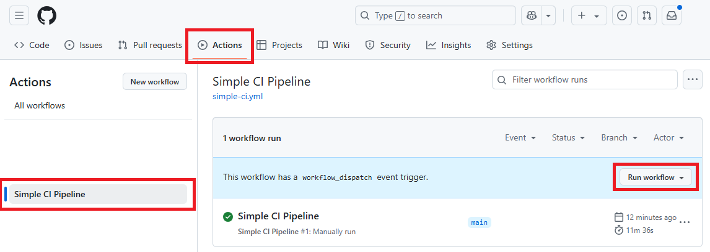

# CI Workflow Demo

This repository contains a demo project for a CI workflow.
The project is a monorepo with multiple services.
Each service contains business logic, tests, and infrastructure code.

### Technology

- Programming Language: [TypeScript](https://www.typescriptlang.org/docs/)
- Infrastructure: [AWS CDK](https://docs.aws.amazon.com/cdk/v2/guide/getting_started.html)
- Testing Framework: [Jest](https://jestjs.io/docs/getting-started)
- Code Quality: [ESLint](https://eslint.org/docs/latest/use/getting-started)
- Code Formatting: [Prettier](https://prettier.io/docs/en/install.html)
- CI/CD: [GitHub Actions](https://docs.github.com/en/actions)

### System Requirements

- Node.js v20+: [Download](https://nodejs.org/en/download/)
    - Test Command: `node -v`
- NPM v10+: Gets installed with Node.js
    - Test Command: `npm -v`
- Recommended IDE:
    - Visual Studio Code: [Download](https://code.visualstudio.com/download)
    - IntelliJ IDEA: [Download](https://www.jetbrains.com/idea/download/)

### Scripts

> All scripts can get executed from the root directory.

```shell
npm install

npm run build
npm run lint
npm run test
npm run test:int
npm run test:e2e
npm run deploy
```

### Mono-Repo Packages

```
|-----------|      |-----------|      |-----------|
| Service 1 |      | Service 1 |      | Service 1 |
|-----------|      |-----------|      |-----------|
```

__Description:__

- [Service 1](./packages/service-1): a simple & independent service with business logic, tests, and infrastructure code
- [Service 2](./packages/service-2): identical to Service 1 with medium load
- [Service 3](./packages/service-3): identical to Service 1 with highest load

## CI/CD Pipelines

All pipelines are created with a manual trigger:



### Simple CI Pipeline

__Workflow YAML__: [Simple CI Pipeline](./.github/workflows/simple-ci.yml)

- Build Job
    - Checkout code
    - Install Node.js (including NPM)
    - Prepare NPM Cache
    - Install Dependencies
    - Run NPM Script
- Test Job
    - Checkout code
    - Install Node.js (including NPM)
    - Prepare NPM Cache
    - Install Dependencies
    - Run NPM Script
- Deploy Job
    - Checkout code
    - Install Node.js (including NPM)
    - Prepare NPM Cache
    - Install Dependencies
    - Run NPM Script

### Eco CI Demo Pipeline

> See [github.com/eco-ci](https://github.com/green-coding-solutions/eco-ci-energy-estimation) for more information.

__Workflow YAML__: [Eco CI Demo Pipeline](./.github/workflows/eco-ci-demo.yml)

- Eco-CI Job
    - Eco-CI Initialization
    - Install Node.js (including NPM)
    - Eco-CI Measurement
    - Eco-CI Results

### Advanced CI Pipeline

__Workflow YAML__: [Advanced CI Pipeline](./.github/workflows/advanced-ci.yml)

- Build Job
    - Checkout code
    - Install Node.js (including NPM)
    - Prepare NPM Cache
    - Install Dependencies
    - Run NPM Script
- Test Job
    - Checkout code
    - Install Node.js (including NPM)
    - Prepare NPM Cache
    - Install Dependencies
    - Run NPM Script
- Lint Job
    - Checkout code
    - Install Node.js (including NPM)
    - Prepare NPM Cache
    - Install Dependencies
    - Run NPM Script
- Security Scan Job
    - Checkout code
    - Initialize CodeQL
    - Perform CodeQL Analysis
- Deploy Job
    - Checkout code
    - Install Node.js (including NPM)
    - Prepare NPM Cache
    - Install Dependencies
    - Run NPM Script

### Mono Repo CI Pipeline

__Workflow YAML__: [Mono Repo CI Pipeline](./.github/workflows/mono-repo-ci.yml)

- Build Job
    - Checkout code
    - Set up Node.js
    - Install dependencies
    - Build each service
- Test Job
    - Checkout code
    - Set up Node.js
    - Install dependencies
    - Run tests for each service
- Lint Job
    - Checkout code
    - Set up Node.js
    - Install dependencies
    - Run lint for each service
- Security Scan Job
    - Checkout code
    - Initialize CodeQL
    - Perform CodeQL Analysis
- Deploy Job
    - Checkout code
    - Set up Node.js
    - Install dependencies
    - Deploy each service

### Canary Deployment Pipeline

__Workflow YAML__: [Canary Deployment Pipeline](./.github/workflows/canary-deployment.yml)

> Prerequisite: Setup of environment `deployment-approval` with enabled __Required reviewers__

- Deployment Job
    - Checkout code
    - Deploy Artifact
- Deployment Evaluation (optional if __enabled__)
    - Is pending until the manual approval through the `deployment-approval` environment
- Continue Deployment Job
    - Update Environment to new Version if __approved__
- Rollback Deployment Job
    - Rollback Environment to old Version if __rejected__

## Service X

### Scripts

> All npm scripts can get executed from within the package directories.

```shell
npm install
cd ./packages/service-X

npm run build
npm run lint
npm run test
npm run test:int
npm run test:e2e
npm run deploy
```

### Package Structure

The content of each service package is identical.

It is design to represent a microservice with realistic load on build, test, and deployment.
The code itself is simple and does not contain any business logic. It just produces load for the CI/CD pipeline.

```
packages
  |--- service-X
        |--- cdk                --> aws cdk code (infrastructure)
        |--- src                --> source code (business logic)
        |--- test               --> jest tests: unit, integration, e2e
        |--- cdk.json           --> aws cdk configuration
        |--- package.json       --> service dependencies and scripts
        |--- tsconfig.json      --> typescript configuration

```


